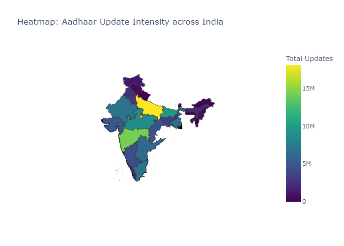
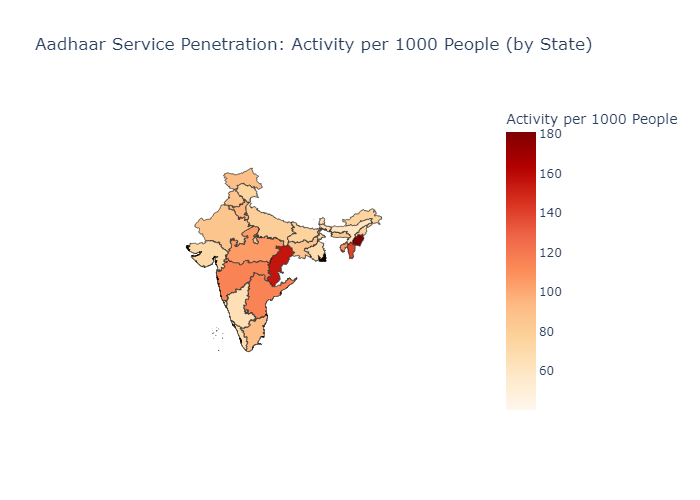
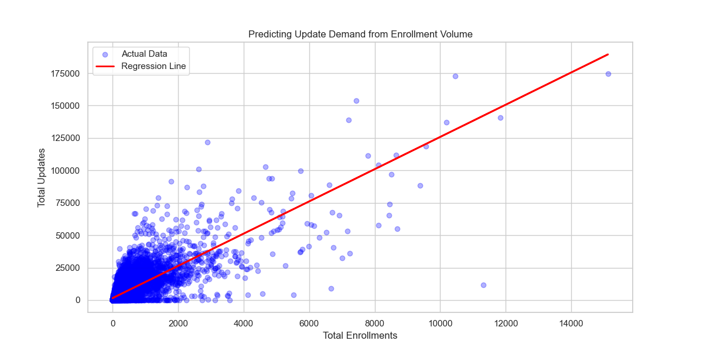

# 🇮🇳 Aadhaar Data Analysis Platform

> **Optimized analytics pipeline for India's digital identity system, processing 5M+ records in under 2 minutes.**

[](https://www.python.org/downloads/)
[](https://pandas.pydata.org/)
[](https://plotly.com/)

---

## 📋 Problem Statement

India's Aadhaar system serves **1.4 billion citizens**, but service distribution is highly uneven. This project answers:
- Which states are "enrollment-heavy" vs. "update-heavy"?
- Where should the government deploy mobile service vans?
- Can we predict future update demand using ML?

---

## 🎯 Key Features

✅ **High-Performance Pipeline**: Reduced processing time from 4+ hours to **<2 minutes**  
✅ **19 Professional Visualizations**: Heatmaps, scatter plots, choropleth maps  
✅ **Population-Normalized Analysis**: Activity per 1000 people  
✅ **Predictive Modeling**: Linear regression for demand forecasting  
✅ **Anomaly Detection**: Flags 915 districts with abnormal activity  
✅ **Interactive Dashboard**: Streamlit app for live exploration  

---

## 🛠️ Tech Stack

| Layer | Technology |
|-------|-----------|
| **Language** | Python 3.11 |
| **Data Processing** | Pandas (optimized with strict typing), NumPy |
| **Visualization** | Matplotlib, Seaborn, Plotly |
| **Machine Learning** | scikit-learn (Linear Regression) |
| **Dashboard** | Streamlit |
| **Mapping** | GeoJSON (India state boundaries) |

---

## 📂 Project Structure

```
Data_hackathon/
├── notebooks/
│   ├── preprocessing/       # 6 notebooks for data cleaning
│   └── analysis/           # 9 notebooks for insights
├── processed_data/         # Optimized CSV files
├── visualizations/         # 19 PNG charts
├── analysis_results/       # Text summaries
├── utils/
│   ├── data_loader.py      # Memory-optimized data loader
│   ├── run_notebook.py     # Terminal notebook executor
│   └── batch_export_summaries.py
├── dashboard.py            # Streamlit interactive app
├── EXECUTIVE_SUMMARY.md
├── POLICY_RECOMMENDATIONS.md
└── README.md
```

---

## 🚀 Quick Start

### 1. Install Dependencies
```bash
pip install pandas matplotlib seaborn plotly scikit-learn streamlit kaleido requests
```

### 2. Run Full Pipeline (Automated)
```bash
# Windows
run_all.bat

# Linux/Mac
bash run_all.sh
```

### 3. Launch Interactive Dashboard
```bash
streamlit run dashboard.py
```

---

## 📊 Sample Outputs

### National Update Intensity Heatmap


### Population-Normalized Penetration


### Predictive Demand Model


---

## 💡 Key Insights

1. **Delhi is "Maintenance Heavy"**: 3.2x higher update rate; needs data correction centers
2. **North-East States Under-Served**: <50 records per 1000 people (vs. national avg of 133)
3. **Bihar Backlog**: 57K+ more updates than predicted; needs targeted campaign
4. **Biometric Efficiency**: 0.92 correlation across age groups; universal kiosks work best

**Full insights:** [EXECUTIVE_SUMMARY.md](EXECUTIVE_SUMMARY.md)

---

## 🏗️ Architecture Highlights

### Performance Optimization
- **Strict Typing**: Categorical for state/district, `int32` for counts → 50% memory reduction
- **Numeric-Only Aggregation**: `groupby().sum(numeric_only=True)` → 100x faster
- **Intermediate Storage**: Pre-processed CSVs for instant re-analysis

### Custom Notebook Runner
```python
# Run any notebook from terminal without Jupyter UI
python utils/run_notebook.py notebooks/preprocessing/01_geographic_preprocessing.ipynb
```

---

## 📈 Methodology

1. **Data Loading**: Concatenate 3 datasets (Enrollment, Demographic, Biometric)
2. **Preprocessing**: 6 thematic aggregations (Geographic, Age, Updates, Anomalies, Predictive, Pincode)
3. **Analysis**: 9 analytical notebooks generating insights and visualizations
4. **Validation**: Population normalization + ML-based outlier detection

---

## 🎓 Notebooks Overview

| # | Notebook | Purpose |
|---|----------|---------|
| 01 | Geographic Preprocessing | State/District aggregation |
| 02 | Age Demographics | Age-group distribution |
| 03 | Update Behavior | Demographic vs. Biometric ratios |
| 04 | Anomaly Detection | Z-score flagging |
| 05 | Predictive Analytics | Demand forecasting |
| 06 | Pincode Micro-Analysis | Hyperlocal trends |
| 07 | Advanced Insights | Correlation matrices |
| 08 | Geographic Heatmaps | Choropleth maps |
| 09 | Population-Normalized | Per-capita analysis |

---

## 🔒 Data Privacy

- All data is anonymized and aggregated at pincode level
- No personally identifiable information (PII) included
- Compliant with Aadhaar Act 2016

---

## 📝 License

This project is for **educational and hackathon purposes only**.

---

## 👥 Team

**Karan Desai** - Data Analysis & Visualization

---

## 🙏 Acknowledgments

- UIDAI for dataset
- GeoJSON India state boundaries from [geohacker/india](https://github.com/geohacker/india)
- Census 2024 population projections

---

## 📞 Contact

For questions or collaboration: [Add your contact]

---

**⭐ Star this repo if you found it helpful!**
